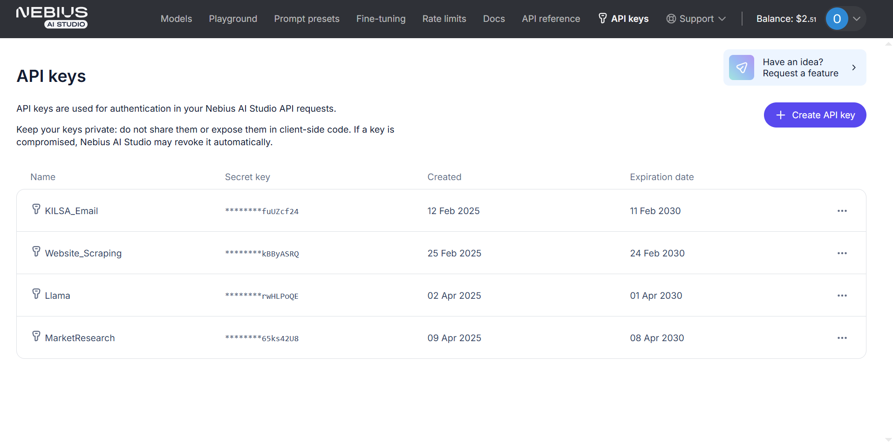
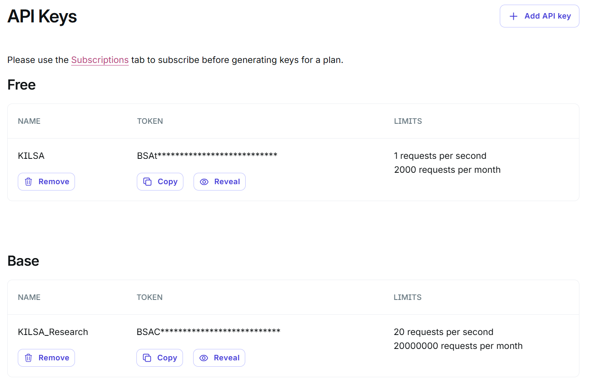
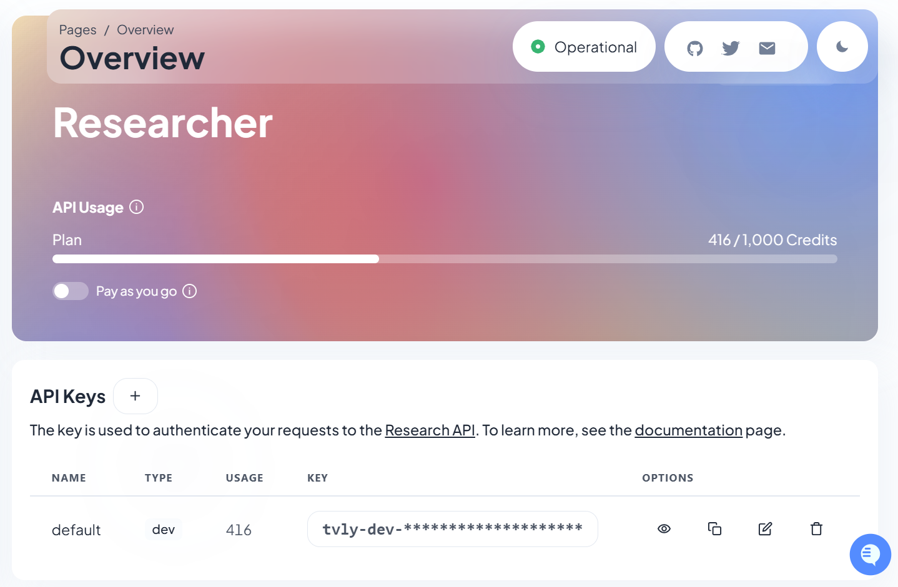

# API Key Maintenance Guide
## Managing API Keys for MCP Servers

This guide explains how to maintain and manage the API keys used by the Model Context Protocol (MCP) servers in your project.

---

## 1. Nebius API (Semantic Search Server)

The semantic search server uses the Nebius API for AI services. This API key is formatted to be compatible with OpenAI's API structure but points to Nebius's endpoint.



### Monitoring and Maintenance

- **Dashboard**: [https://studio.nebius.com/settings/api-keys](https://studio.nebius.com/settings/api-keys)
- **Billing**: Ensure the Nebius account has sufficient funds to handle the API requests
- **Expiration**: The current key is set to expire on April 8, 2030, but check occasionally to ensure it remains valid

### If the Key Needs Replacement

1. Generate a new API key from the Nebius dashboard
2. Update the `OPENAI_API_KEY` environment variable in the `semantic-search` section of your MCP configuration:

```json
"semantic-search": {
  "command": "docker",
  "args": [
    "run", 
    "--rm",
    "-i",
    "-e", "OPENAI_API_KEY=your_new_nebius_key_here",
    // other args remain the same
  ]
}
```

> **Important**: The Nebius API key must be used with the correct API base URL (`https://api.studio.nebius.com/v1/`). Do not change this URL unless Nebius changes their API endpoint.

---

## 2. Brave Search API

Brave Search API provides web search capabilities to Claude, enabling real-time information retrieval.



### Monitoring and Maintenance

- **Dashboard**: [https://api-dashboard.search.brave.com/app/keys](https://api-dashboard.search.brave.com/app/keys)
- **Free Plan Limits**: 1 query/second, 2,000 queries/month
- **Base Plan**: If you need more capacity, consider upgrading to the Base plan ($3 CPM, 20 queries/second, up to 20M queries/month)

### Choosing the Right Plan

- **Free Plan**: Sufficient for individual or small team usage with moderate search needs
- **Base Plan**: Recommended for more intensive research projects or when supporting multiple simultaneous users
- **Pro Plan**: Only needed for high-volume or enterprise applications

### Updating the API Key

1. Generate a new API key from the Brave Search dashboard
2. Update the `BRAVE_API_KEY` environment variable in your MCP configuration:

```json
"brave-search": {
  "command": "docker",
  "args": [
    "run",
    "--rm",
    "-i",
    "-e", "BRAVE_API_KEY=your_new_brave_api_key_here",
    "mcp/brave-search"
  ]
}
```

---

## 3. Tavily Search API

Tavily provides specialized search capabilities with enhanced context retrieval for deeper research scenarios.



### Monitoring and Maintenance

- **Dashboard**: [https://app.tavily.com/home](https://app.tavily.com/home)
- **Free Plan Limits**: 1 request per second, 2,000 requests per month
- **Recommendation**: The free plan is sufficient for most market research projects

### If the Key Needs Replacement

1. Generate a new API key from the Tavily dashboard
2. Update the `TAVILY_API_KEY` environment variable in your MCP configuration:

```json
"tavily": {
  "command": "docker",
  "args": [
    "run",
    "--rm",
    "-i",
    "-e", "TAVILY_API_KEY=your_new_tavily_api_key_here",
    "mcp/tavily"
  ]
}
```

---

## Best Practices for API Key Management

1. **Regular Monitoring**: Check usage and billing at least once a month
2. **Security**: Never share API keys publicly or commit them to public repositories
3. **Rotation**: Consider rotating keys every 6-12 months as a security practice
4. **Testing**: After replacing any key, test the respective server to ensure it's working correctly
5. **Documentation**: Keep a secure record of all API keys and their expiration dates

---

For any questions about API key management or issues with the services, please contact the development team.